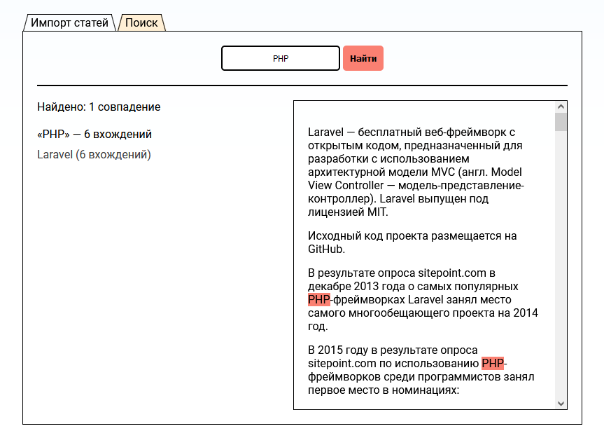

## Тестовое задание для компании CUBA

Wiki-import – микро-приложение, позволяющее импортировать текст статей из Wikipedia во внутреннюю базу данных
с возможностью дальнейшей навигации и поиска по импортированным статьям.

Во вкладке *«Импорт статей»* производится поиск и импорт статьи по заголовку
(введённое слово или фраза должны совпадать с заголовком статьи)
с последующим подсчётом количества слов и размера статьи.

Вкладка «Поиск» предоставляет возможность поиска по словам-атомам, 
хранящимся в отдельной таблице и связанными с импортированными статьями,
и просмотра текста статьи с найденными вхождениями.

